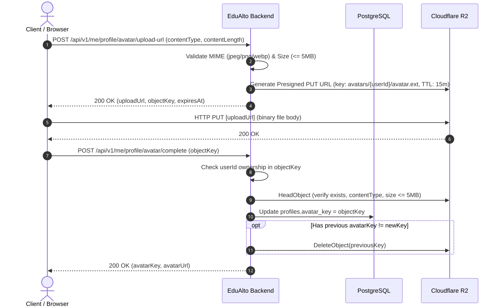

# API Design

Base path: `/api/v1`.

API của EduAlto dùng REST, JSON, DTO rõ ràng và error format nhất quán. User-facing `message` dùng tiếng Việt; API path, field name và machine-readable `code` dùng tiếng Anh.

## Response format

Success:

```json
{
  "success": true,
  "data": {},
  "meta": null
}
```

Paginated success:

```json
{
  "success": true,
  "data": [],
  "meta": {
    "page": 0,
    "size": 20,
    "totalElements": 100,
    "totalPages": 5,
    "sort": "publishedAt,desc"
  }
}
```

Error:

```json
{
  "success": false,
  "error": {
    "code": "VALIDATION_ERROR",
    "message": "Dữ liệu không hợp lệ",
    "details": []
  },
  "timestamp": "2026-09-16T00:00:00Z",
  "path": "/api/v1/courses"
}
```

## Conventions

- Dùng nouns, không dùng verbs trong resource path.
- Prefix mọi endpoint bằng `/api/v1`.
- Request/response dùng DTO, không expose entity.
- Pagination dùng `page`, `size`, `sort`.
- Search/filter dùng `q` và field filter rõ nghĩa.
- `message` an toàn cho end user, không chứa stack trace/class name.
- OpenAPI phải phản ánh endpoint thật.

## Authentication

```text
POST /api/v1/auth/register
POST /api/v1/auth/verify-email
POST /api/v1/auth/resend-verification
POST /api/v1/auth/login
POST /api/v1/auth/refresh
POST /api/v1/auth/logout
POST /api/v1/auth/forgot-password
POST /api/v1/auth/verify-reset-otp
POST /api/v1/auth/reset-password
```

Registration flow:

1. User gửi `fullName`, `email`, `password`, `confirmPassword`, `role` (`STUDENT` hoặc `INSTRUCTOR`, mặc định `STUDENT`), cùng thông tin khởi tạo vai trò:
   - `STUDENT`: `learningGoal` (tùy chọn).
   - `INSTRUCTOR`: `expertise` (bắt buộc), `bio` (tùy chọn).
   - Tài khoản `ADMIN` không được phép đăng ký qua public API.
2. Backend validate input & authoritative role, hash password, khởi tạo `Profile` và profile theo vai trò (`StudentProfile` hoặc `InstructorProfile`), sau đó gửi email OTP.
3. User verify OTP.
4. Account chuyển sang `ACTIVE` với vai trò tương ứng (`STUDENT` hoặc `INSTRUCTOR`).

Login không yêu cầu OTP mỗi lần.

Password reset flow:

1. User yêu cầu reset bằng email.
2. Backend trả message an toàn, không tiết lộ email có tồn tại hay không.
3. User verify reset OTP.
4. User đặt mật khẩu mới bằng OTP đã verify.

## Users and profile

Endpoint current user:

```text
GET /api/v1/me
PUT /api/v1/me
```

Endpoint profile riêng thuộc profile module:

```text
GET  /api/v1/me/profile
PUT  /api/v1/me/profile
POST /api/v1/me/profile/avatar/upload-url
POST /api/v1/me/profile/avatar/complete
```

- `GET /api/v1/me/profile`: Trả về `UserProfileResponse` tổng hợp gồm thông tin tài khoản cơ bản (`users.full_name`, email, trạng thái, vai trò), thông tin hồ sơ chung (`headline`, `bio`, `avatarKey`, `avatarUrl`, `language`, liên kết mạng xã hội), `studentProfile` (nếu có) và `instructorProfile` (nếu có).
- `PUT /api/v1/me/profile`: Nhận `UpdateProfileRequest` cho phép cập nhật `fullName` (cập nhật trực tiếp `users.full_name` - nguồn dữ liệu gốc duy nhất), thông tin hồ sơ chung, và các trường của học viên / giảng viên.
- `POST /api/v1/me/profile/avatar/upload-url`: Khởi tạo luồng direct upload avatar lên Cloudflare R2 bằng presigned PUT URL. Nhận `contentType` (chỉ chấp nhận `image/jpeg`, `image/png`, `image/webp`) và `contentLength` (tối đa 5MB), trả về `uploadUrl`, `objectKey` (định dạng `avatars/{userId}/avatar.{ext}`) và `expiresAt`.
- `POST /api/v1/me/profile/avatar/complete`: Xác nhận hoàn tất upload sau khi client gửi trực tiếp file lên Cloudflare R2. Backend kiểm tra quyền sở hữu object key, kiểm tra file tồn tại và đúng metadata trên R2 qua `HeadObject`, cập nhật `profiles.avatar_key = objectKey`, đồng thời tự động xóa avatar cũ nếu có.

Sequence diagram luồng upload avatar:



Admin:

```text
GET  /api/v1/admin/users
GET  /api/v1/admin/users/{userId}
PUT  /api/v1/admin/users/{userId}/status
POST /api/v1/admin/users/{userId}/roles
```

## Courses

```text
GET    /api/v1/courses
GET    /api/v1/courses/{courseId}
POST   /api/v1/courses
PUT    /api/v1/courses/{courseId}
DELETE /api/v1/courses/{courseId}
GET    /api/v1/categories
POST   /api/v1/courses/{courseId}/enrollments
GET    /api/v1/me/enrollments
```

Filters:

```text
GET /api/v1/courses?q=java&category=backend&level=beginner&page=0&size=12&sort=publishedAt,desc
```

Public course listing chỉ trả khóa học `PUBLISHED`.

Giảng viên quản lý khóa học của mình qua các endpoint sau:

```text
POST   /api/v1/instructor/courses
GET    /api/v1/instructor/courses
GET    /api/v1/instructor/courses/{id}
PUT    /api/v1/instructor/courses/{id}
POST   /api/v1/instructor/courses/{id}/publish
POST   /api/v1/instructor/courses/{id}/archive
DELETE /api/v1/instructor/courses/{id}
```

Chỉ chủ sở hữu khóa học mới được quản lý khóa học đó. Xóa cứng chỉ áp dụng cho khóa học `DRAFT`; khóa học đã xuất bản hoặc lưu trữ không thể xóa để bảo toàn lịch sử ghi danh và giao dịch. Dùng thao tác lưu trữ để gỡ khóa học khỏi danh mục công khai.

## Learning

```text
GET  /api/v1/courses/{courseId}/sections
GET  /api/v1/lessons/{lessonId}
GET  /api/v1/lessons/{lessonId}/video-access
POST /api/v1/lessons/{lessonId}/complete
GET  /api/v1/me/courses/{courseId}/progress
```

Giảng viên sở hữu khóa học tải video lên R2 bằng luồng `POST /api/v1/instructor/courses/{courseId}/sections/{sectionId}/lessons/{lessonId}/video-upload-url` rồi gọi `.../video-upload-complete`. Backend chỉ cấp URL cho bài học `VIDEO`, giới hạn MP4/WebM tối đa 2 GB, sinh object key và xác minh metadata từ R2 trước khi gắn tệp vào bài học. PUT phải gửi `Content-Type` và `Cache-Control: private, no-store` đúng như chữ ký; cấu hình CORS của bucket cần cho phép hai header này. Học viên đã ghi danh đang hoạt động lấy liên kết phát có hạn 10 phút qua `GET /api/v1/lessons/{lessonId}/video-access`; endpoint media công khai không phục vụ namespace `course-videos/`. Giữ bucket R2 ở chế độ riêng tư và không cấu hình `publicUrlPrefix` cho namespace `course-videos/` để URL ký sẵn là đường truy cập duy nhất tới video.

## Quiz

```text
POST /api/v1/instructor/lessons/{lessonId}/quiz
GET  /api/v1/lessons/{lessonId}/quiz
POST /api/v1/lessons/{lessonId}/quiz-attempts
```

Giảng viên chỉ tạo một quiz cho bài học dạng `QUIZ` đã xuất bản trong khóa học của mình. Người học phải có ghi danh đang hoạt động để xem câu hỏi và nộp bài. Response câu hỏi không chứa đáp án đúng; mỗi câu hỏi cần từ 2 đến 6 lựa chọn và đúng một lựa chọn đúng. Bài nộp phải trả lời mỗi câu đúng một lần; backend chấm điểm, lưu attempt cùng câu trả lời và trả `score`, `correctAnswers`, `totalQuestions`, `passed`, `submittedAt`. Đạt điểm yêu cầu sẽ hoàn thành bài học trong tiến độ học tập.

## Assignment

```text
GET  /api/v1/me/assignments
POST /api/v1/assignments/{assignmentId}/submissions
PUT  /api/v1/assignments/{assignmentId}/submissions/me
GET  /api/v1/instructor/courses/{courseId}/assignments
POST /api/v1/instructor/courses/{courseId}/assignments
PUT  /api/v1/instructor/assignments/{assignmentId}
POST /api/v1/instructor/assignments/{assignmentId}/publish
POST /api/v1/instructor/assignments/{assignmentId}/archive
GET  /api/v1/instructor/assignments/{assignmentId}/submissions
PUT  /api/v1/instructor/assignments/{assignmentId}/submissions/{submissionId}/grade
```

Người học cần ghi danh đang hoạt động và bài tập phải được xuất bản mới có thể nộp bài. Có thể cập nhật bài nộp trước hạn cho đến khi giảng viên chấm điểm; bài đã chấm không thể bị thay thế, để tránh mất điểm và nhận xét. Chỉ giảng viên sở hữu khóa học được quản lý bài tập và chấm bài. Bài nộp hiện hỗ trợ văn bản; file upload cần validate dung lượng, loại file và storage metadata trước production.

## Documents and notes

```text
GET    /api/v1/courses/{courseId}/documents
POST   /api/v1/documents/{documentId}/save
DELETE /api/v1/documents/{documentId}/save
GET    /api/v1/me/saved-documents
GET    /api/v1/me/notes
POST   /api/v1/me/notes
PUT    /api/v1/me/notes/{noteId}
DELETE /api/v1/me/notes/{noteId}
```

## Discussion

```text
GET  /api/v1/courses/{courseId}/discussions
POST /api/v1/courses/{courseId}/discussions
POST /api/v1/discussions/{discussionId}/comments
```

## Messaging and WebSocket

REST:

```text
GET  /api/v1/conversations
POST /api/v1/conversations
GET  /api/v1/conversations/{conversationId}/messages
```

WebSocket/STOMP:

```text
CONNECT   /ws
SEND      /app/conversations/{conversationId}/messages
SUBSCRIBE /topic/conversations/{conversationId}
SUBSCRIBE /user/queue/notifications
```

REST là nguồn đồng bộ lại sau reconnect; WebSocket không thay thế persistence.

## Notifications

```text
GET  /api/v1/me/notifications
POST /api/v1/me/notifications/{notificationId}/read
POST /api/v1/me/notifications/read-all
```

## Analytics

```text
GET /api/v1/me/analytics/learning-summary
GET /api/v1/instructor/courses/{courseId}/analytics
GET /api/v1/admin/analytics/overview
```

Student chỉ đọc dữ liệu của chính mình. Instructor chỉ đọc course mình quản lý. Admin đọc toàn hệ thống.

## Recommendations

Future AI extension:

```text
GET  /api/v1/me/recommendations
POST /api/v1/admin/ai/model-versions
GET  /api/v1/admin/ai/model-versions
```

Nếu chưa có recommendation, frontend hiển thị `Chưa có gợi ý học tập phù hợp`.

## HTTP status

- `200 OK` cho read/update thành công.
- `201 Created` cho create.
- `204 No Content` cho delete/mark action không cần body.
- `400 Bad Request` cho malformed input.
- `401 Unauthorized` cho thiếu/sai auth.
- `403 Forbidden` cho không đủ quyền.
- `404 Not Found` cho resource không tồn tại hoặc không được phép biết tồn tại.
- `409 Conflict` cho duplicate/trạng thái xung đột.
- `422 Unprocessable Entity` cho domain validation fail.
- `500 Internal Server Error` cho lỗi bất ngờ với message an toàn.

## Implemented enrollment and learning foundation

The following endpoints are implemented with the standard success/error wrappers. The current authenticated account must be an active student; account IDs are taken from authentication, never request bodies.

| Method | Path | Behavior |
| --- | --- | --- |
| POST | `/api/v1/courses/{courseId}/enrollments` | UUID course ID; free published courses only. Returns `200` with the enrollment UUID in `data`. Retrying returns the same ID. |
| GET | `/api/v1/me/enrollments` | Own enrollment history, including archived courses. `page=0`, `size=20` (1–100), `sort=enrolledAt,desc` or `enrolledAt,asc`; stable ID tie-breaker. |
| GET | `/api/v1/lessons/{lessonId}` | Published text lesson content for enrolled students. No storage keys or assessment answers. |
| POST | `/api/v1/lessons/{lessonId}/complete` | Idempotent explicit completion of a published text lesson. Returns updated course progress. |
| GET | `/api/v1/me/courses/{courseId}/progress` | Own progress for a published course: `courseId`, `totalLessons`, `completedLessons`, integer `progressPercent`, `completed`. |

Enrollment history items contain `id`, `courseId`, `courseTitle`, `courseSlug`, `courseStatus`, `status`, `enrolledAt`. Course detail and public curriculum continue to use slugs; enrollment/progress use UUIDs.

Error cases: `401` anonymous; `403 STUDENT_REQUIRED` for an ineligible account; `403 ENROLLMENT_REQUIRED` for missing enrollment; `404` unpublished/missing content; `409 PAYMENT_REQUIRED` for new paid enrollments; `409 OWN_COURSE_ENROLLMENT` for own courses; `409 LESSON_TYPE_NOT_SUPPORTED` when manually completing a lesson type that does not support manual completion; `400 INVALID_PAGINATION` or `INVALID_PARAMETER` for invalid query/path parameters.

Progress counts currently published lessons. Manual completion is supported for text and video lessons; quiz completion comes from scored attempts. Empty courses are not complete. Existing enrollment remains valid if the price later changes; archived courses remain in history but content access is blocked. Video playback uses expiring signed URLs after enrollment checks; quiz attempts and assignment submissions are persisted through their own APIs. Certificate issuance remains a follow-up area.
