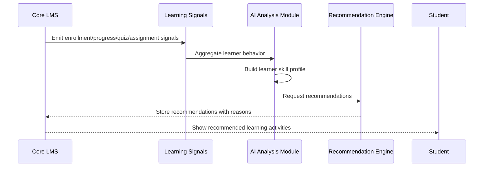

# AI Extension Architecture

AI trong EduAlto là extension của LMS, không phải dependency bắt buộc của core LMS.

## Goals

- Phân tích kỹ năng học viên.
- Gợi ý khóa học, bài học, tài liệu hoặc hoạt động học tiếp theo.
- Giải thích lý do gợi ý bằng dữ liệu minh bạch.
- Lưu version model và metadata để audit.

## Non-goals in foundation

- Không implement AI model.
- Không gọi API AI production.
- Không hard-code AI logic trong CourseService hoặc LearningProgressService.

## Data flow

## Boundaries

Core modules emit learning signals. AI module consumes signals asynchronously or through scheduled jobs. Course, lesson and learning services must not depend on AI services directly.

## AI-related tables

- `skills`
- `skill_categories`
- `learner_skills`
- `skill_assessments`
- `learning_signals`
- `recommendations`
- `recommendation_items`
- `recommendation_reasons`
- `ai_model_versions`

## Failure behavior

If AI module is unavailable:

- Course browsing works.
- Lesson learning works.
- Quiz/assignment works.
- Recommendations are hidden or show empty state: `Chưa có gợi ý học tập phù hợp`.

## Privacy and safety

- Store only learning data needed for recommendation quality.
- Keep model input/output metadata auditable.
- Do not expose raw model prompts or sensitive learner data in frontend.
- Add opt-out policy before production if AI becomes user-facing.
