# EduAlto Architecture

EduAlto sử dụng kiến trúc modular monolith cho nền tảng học tập trực tuyến. Tài liệu này là entrypoint architecture chính cho các Run sau.

## 1. System Overview

EduAlto gồm một web app Next.js, một backend Spring Boot API, PostgreSQL làm source of truth, Redis cho trạng thái tạm/cache/realtime và WebSocket/STOMP cho các use case realtime có giá trị.


## 2. Architecture Style

Quyết định: modular monolith, không bắt đầu bằng microservices.

Lý do:

- Scope đồ án phù hợp với một deployable backend duy nhất.
- Development, test và deploy đơn giản hơn.
- Transaction boundary dễ kiểm soát hơn microservices.
- Module boundary vẫn rõ để có thể tách service trong tương lai nếu domain đủ lớn.

## 3. Technology Stack

- Frontend: Next.js App Router, React, TypeScript, Tailwind CSS, pnpm.
- Backend: Java 25 LTS, Spring Boot, Spring Security, Spring Data JPA, Spring WebSocket/STOMP, OpenAPI.
- Database: PostgreSQL.
- Supporting infrastructure: Redis.
- Containerization: Docker, Docker Compose.
- Testing: Vitest/Testing Library, JUnit 5, Spring Boot Test.

## 4. Enterprise Architecture

Run #2 áp dụng tư duy EA-inspired architecture. EduAlto không claim fully compliant với TOGAF hoặc ArchiMate. Mục tiêu là traceability rõ giữa business capability, application module, data domain và technology component.

EA details: [enterprise-architecture.md](./enterprise-architecture.md)

Diagram standards: [diagram-standards.md](./diagram-standards.md)

## 5. Layer Architecture

Backend dependency direction:

```text
controller -> application/service -> domain -> repository -> infrastructure
```

Quy tắc:

- Controller không chứa business logic.
- Service/application layer sở hữu use case.
- Domain layer chứa entity/value object/rule cốt lõi.
- Repository chỉ truy cập persistence.
- Module khác không gọi trực tiếp internal repository/entity của module khác.
- Cross-module communication dùng application service, DTO, ID/reference hoặc domain event.


## 6. Module Architecture

Module boundaries được chốt ở [module-boundaries.md](./module-boundaries.md).

Nhóm module chính:

- Identity: auth, user, profile, instructor.
- Learning catalog: course, section, lesson, category.
- Enrollment and progress: enrollment, learning.
- Assessment: quiz, assignment.
- Content: document, saved document, note.
- Social/realtime: discussion, messaging, notification.
- Operations: schedule, review, certificate, analytics, admin.
- Extension: ai.



UML component view:

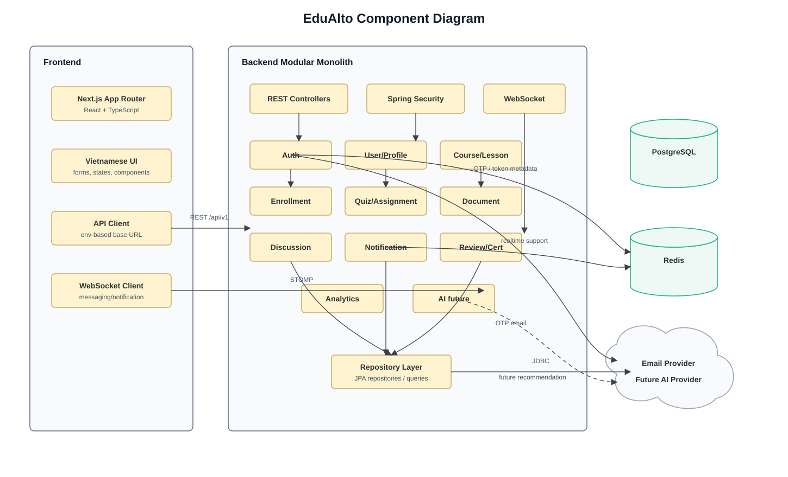

## 7. Dependency Rules

Hard rules:

- `controller` không gọi `repository` trực tiếp khi use case có logic.
- Module A không truy cập database implementation của Module B.
- Module A không phụ thuộc vào JPA entity nội bộ của Module B.
- Shared code trong `common` chỉ chứa API response, config, exception, security utilities và primitives thật sự cross-cutting.
- Không tạo `GenericBaseService` hoặc `GenericBaseController`.

## 8. Authentication

Authentication architecture:

- Registration creates a pending account and email OTP challenge.
- OTP verifies email; account becomes active.
- Login does not require OTP every time.
- Forgot password and change email use OTP.
- Password hashing uses BCrypt.
- Access token + refresh token strategy is planned for later implementation.
- Backend is source of truth; frontend auth state is UX only.

Security details: [authentication-authorization.md](../security/authentication-authorization.md)

UML activity and state views:

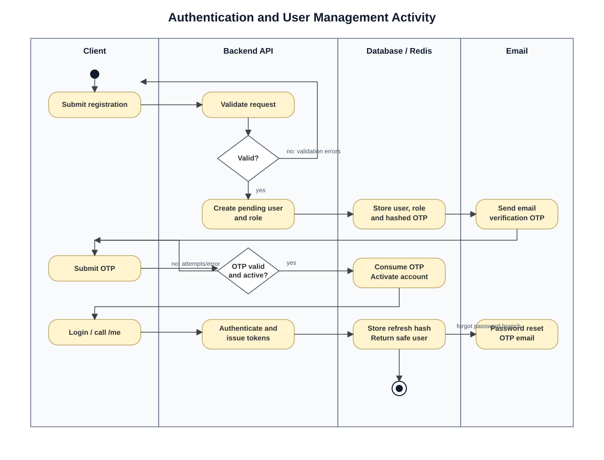

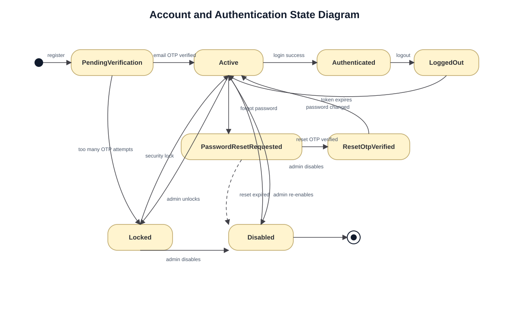

## 9. Authorization

Roles:

- Guest
- Student
- Instructor
- Administrator

Authorization combines RBAC and resource ownership checks. Examples:

- Student cannot read another student's private submission/message/document.
- Instructor cannot modify a course they do not own or manage.
- Student cannot call admin APIs.

Permission matrix: [permission-matrix.md](../security/permission-matrix.md)

## 10. API

Base path: `/api/v1`.

API conventions:

- English resource names.
- RESTful nouns and HTTP methods.
- Pagination with `page`, `size`, `sort`.
- Filtering/search with explicit query parameters.
- Consistent success and error envelopes.
- Validation errors use Vietnamese user-facing messages and English machine-readable codes.
- Idempotent write operations use constraints or idempotency keys where risk exists.

Details: [API design](../api/api-design.md)

## 11. Database

PostgreSQL is the source of truth. Redis is not source of truth.

Database principles:

- UUID primary keys.
- English snake_case table/column names.
- Strong FK and unique constraints.
- Query-driven indexes with documented reason.
- Timestamps on important entities.
- Optimistic locking on mutable aggregate roots when concurrent update risk exists.
- Soft delete only where audit/recovery requires it.
- JSONB only for metadata with justified flexible schema, not as a shortcut around relational design.

Details: [database-design.md](../database/database-design.md)


Full database ERD:


Domain class overview:

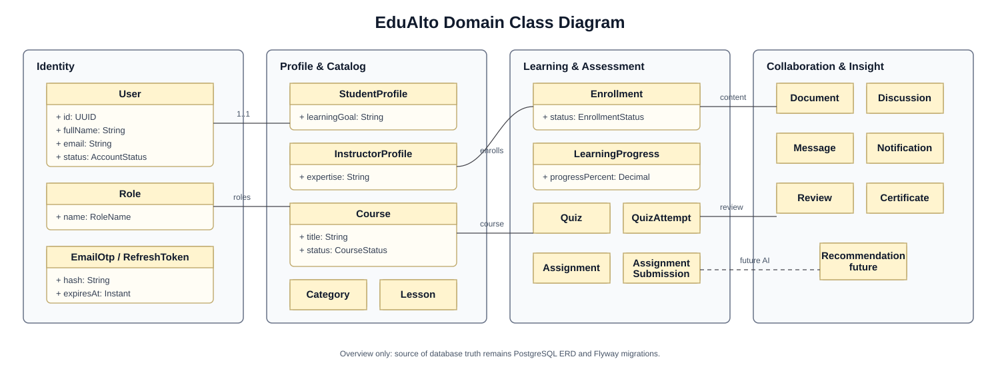

## 12. Redis

Redis use cases are intentionally limited:

- OTP temporary state.
- Rate limiting counters.
- Short-lived cache for read-heavy catalog queries.
- WebSocket/session presence metadata.
- Idempotency/short locks only when DB constraint alone is insufficient.

Details: [redis-strategy.md](./redis-strategy.md)


## 13. WebSocket

WebSocket/STOMP is used for realtime use cases:

- Messaging.
- Notifications.
- Optional discussion realtime.

REST remains default for normal request/response workflows.

Details: [websocket-strategy.md](./websocket-strategy.md)

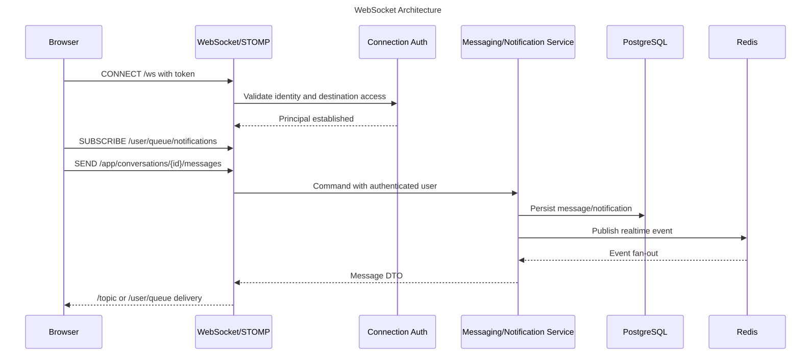

## 14. Security

Primary risks reviewed:

- Password hashing and credential storage.
- OTP brute force and replay.
- Token expiry/refresh/logout.
- IDOR across users, submissions, messages and private documents.
- Instructor ownership enforcement.
- CORS and CSRF strategy.
- XSS in frontend content rendering.
- SQL injection through repository/query design.
- File upload security.
- WebSocket destination authorization.
- Sensitive logging.

Backend must enforce authorization. Frontend route protection is not a security boundary.

## 15. Testing

Testing strategy:

- Unit tests for domain/business rules.
- Controller/API tests for validation/error/authorization mapping.
- Repository/integration tests once schema and migrations are implemented.
- Security tests for permission boundaries.
- WebSocket tests for authenticated delivery and forbidden subscriptions.
- Frontend component tests for states and accessibility.
- E2E tests for critical user journeys in later phases.

Details: [testing-strategy.md](../testing/testing-strategy.md)

## 16. AI Extension

AI is a future extension. Core LMS must work when AI service is absent.

Flow:

```text
Learning behavior -> Learning signals -> Skill assessment -> Skill level -> Recommendation -> Reason
```

AI module reads learning signals and writes recommendations/reasons. Course, enrollment, lesson, quiz and assignment modules do not depend directly on AI.

Details: [ai-extension.md](./ai-extension.md)

## 17. Deployment

Foundation supports local Docker Compose:

- Frontend container.
- Backend container.
- PostgreSQL container.
- Redis container.


## 18. Future Scalability

Potential future extraction candidates:

- Messaging/notification if realtime load grows.
- Analytics/AI if event volume grows.
- Search if PostgreSQL search becomes insufficient.

Extraction is deferred until operational need exists. Until then, module boundaries and data ownership are enforced inside the modular monolith.
