# Architecture

## Decision

EduAlto starts as a modular monolith.

Reasons:

- University project scope does not justify microservices.
- Faster local development and testing.
- Lower operational complexity.
- Clear module boundaries still allow future extraction.
- PostgreSQL transactions remain simple.

## High-level architecture

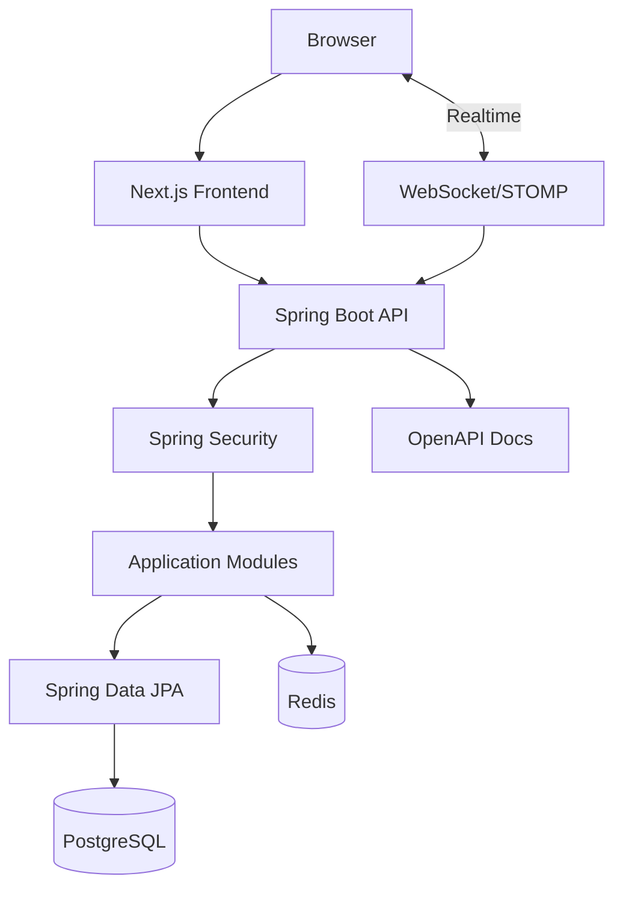

## Backend module dependency

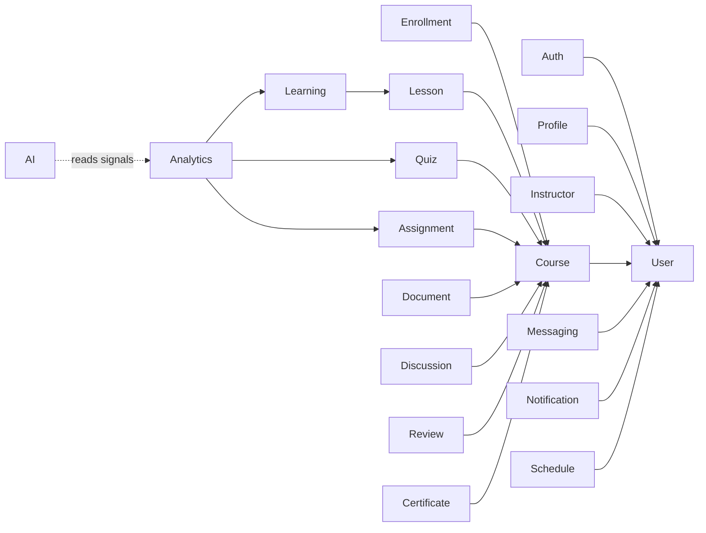

## Backend package structure

```text
com.edualto
├── EduAltoApplication.java
├── common
│   ├── api
│   ├── config
│   ├── exception
│   └── security
├── auth
├── user
├── course
├── enrollment
├── lesson
├── learning
├── quiz
├── assignment
├── document
├── discussion
├── messaging
├── notification
├── schedule
├── review
├── certificate
├── analytics
├── admin
└── ai
```

Each module may contain:

```text
controller/
service/
domain/
repository/
dto/
mapper/
exception/
```

## Frontend structure

```text
src/
├── app/
├── components/
│   ├── ui/
│   ├── layout/
│   ├── course/
│   └── marketing/
├── features/
├── hooks/
├── lib/
├── services/
├── types/
├── constants/
└── styles/
```

## Authentication sequence

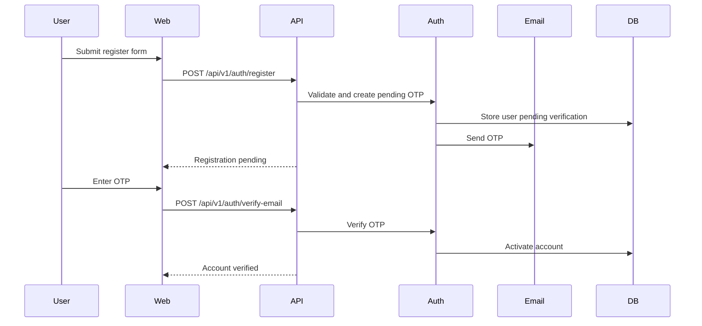

## Course enrollment sequence

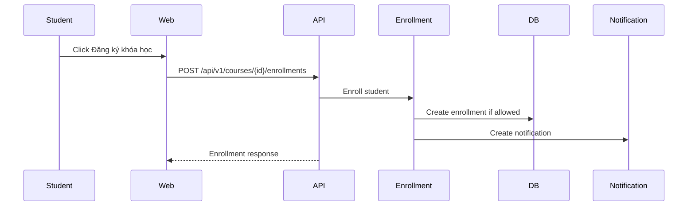

## Lesson learning sequence

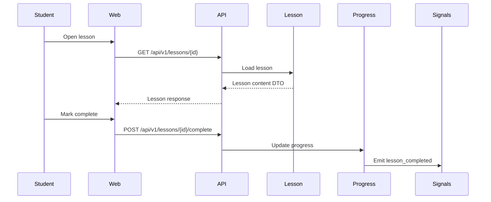

## Quiz submission sequence

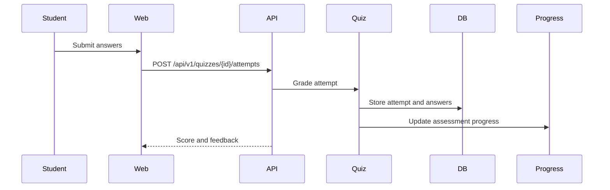

## Assignment submission sequence

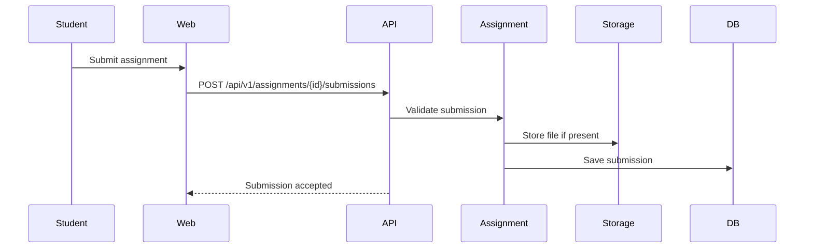

## Messaging/WebSocket sequence

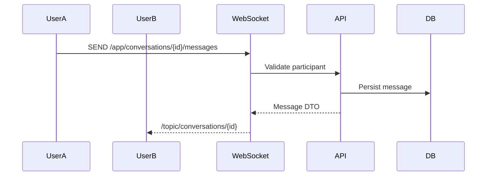

## Notification sequence

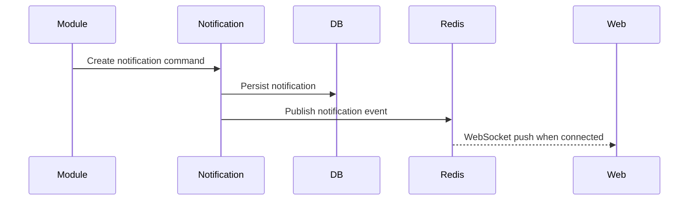

## Learning progress sequence

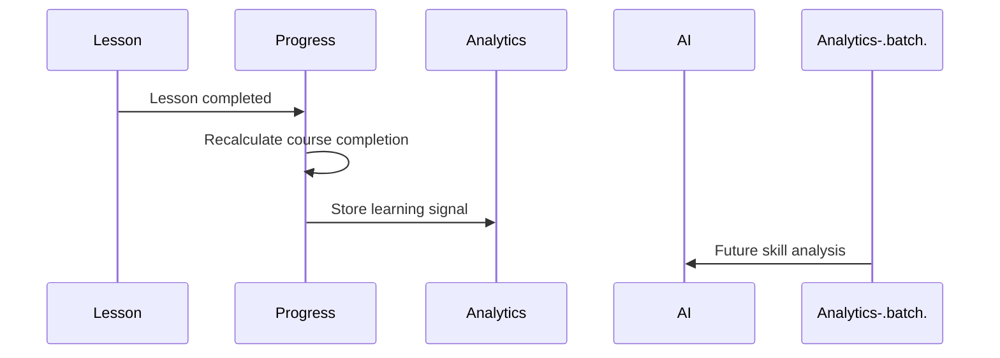

## Future AI recommendation sequence

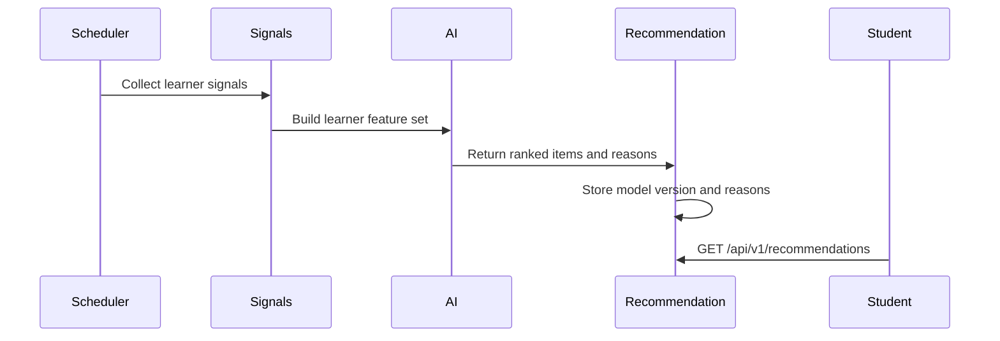

## Security foundation

- Stateless JWT planned for access tokens.
- Refresh token rotation planned.
- Password hashing with BCrypt.
- OTP for email verification, forgot password and change email.
- CORS restricted by environment.
- CSRF reviewed per auth strategy; stateless API can disable CSRF with care.
- Global exception handler avoids stack trace exposure.

## WebSocket foundation

Use WebSocket/STOMP for messaging and notifications. REST remains default for CRUD and request/response workflows.

## Review checklist

- No circular module dependency.
- No business logic in controller.
- DTO/entity separation.
- Vietnamese user-facing text.
- Design tokens aligned with Figma.
- Accessibility and responsive foundation present.
- Tests/build pass before integration.
