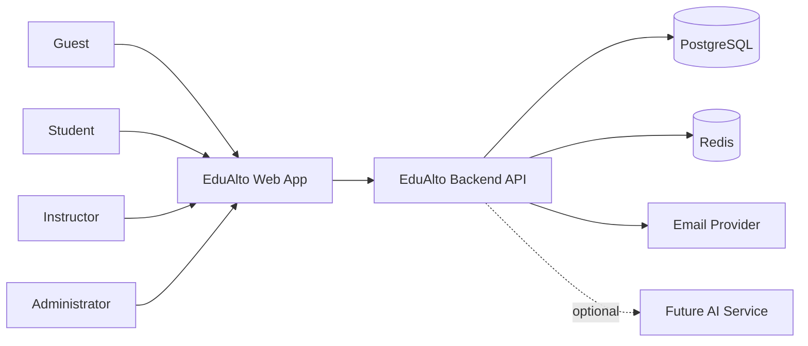
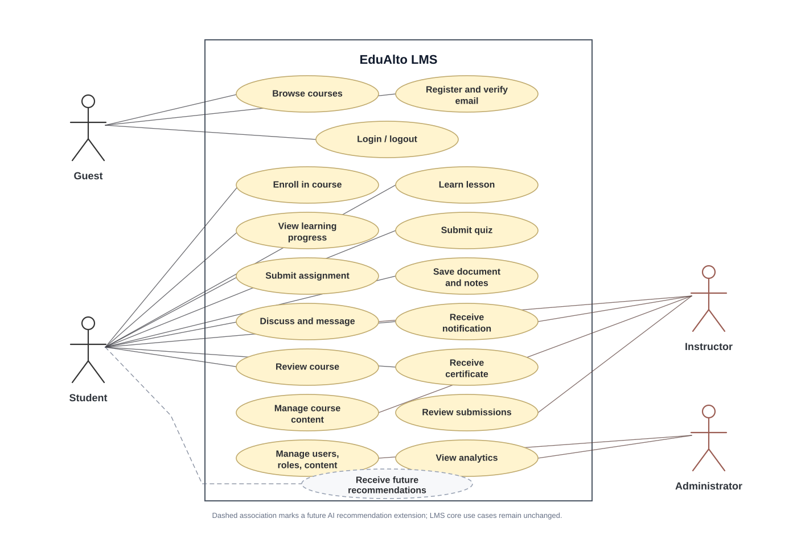
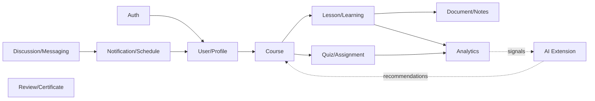

# System Analysis

## Problem

EduAlto cần một nền tảng học tập trực tuyến cho người dùng Việt Nam, hỗ trợ khám phá khóa học, học bài, làm quiz/bài tập, quản lý tài liệu, theo dõi tiến độ, thảo luận, nhắn tin và nhận thông báo. Trong tương lai, hệ thống mở rộng thêm phân tích kỹ năng và gợi ý học tập bằng AI.

## Actors

- Guest: xem trang chủ, tìm kiếm khóa học, đăng ký, đăng nhập.
- Student: ghi danh khóa học, học bài, làm quiz, nộp bài tập, lưu tài liệu, ghi chú, thảo luận, nhắn tin, xem tiến độ và chứng chỉ.
- Instructor: quản lý khóa học, section, lesson, quiz, assignment, tài liệu, thảo luận và feedback.
- Administrator: quản lý user, role, permission, category, nội dung, báo cáo và cấu hình hệ thống.

## Core capabilities

- Authentication and authorization.
- User/profile/instructor management.
- Course, category, section, lesson management.
- Enrollment and learning progress.
- Quiz and assignment assessment.
- Document and saved document.
- Discussion and messaging.
- Notification and schedule.
- Review, rating and certificate.
- Search/filtering and analytics.
- Future AI skill analysis and recommendation.

## System context

## Use case diagram

Source quan hệ actor/use case được giữ tại `docs/architecture/diagrams/02-use-case.mmd`; bản SVG dùng layout UML/EA-style để dễ đọc trong tài liệu.

## Functional module diagram

## Non-functional requirements

- Maintainable modular codebase.
- Vietnamese user-facing language.
- Accessible and responsive UI.
- Secure auth, password hashing and authorization.
- Consistent REST API and error response.
- Data integrity with PostgreSQL constraints.
- Realtime only where it has clear value.
- AI can be disabled without breaking LMS core.

## Foundation constraints

Foundation does not implement the full LMS. It creates structure, standards, docs, Docker, tests, minimal runnable frontend/backend and prepared module boundaries.
