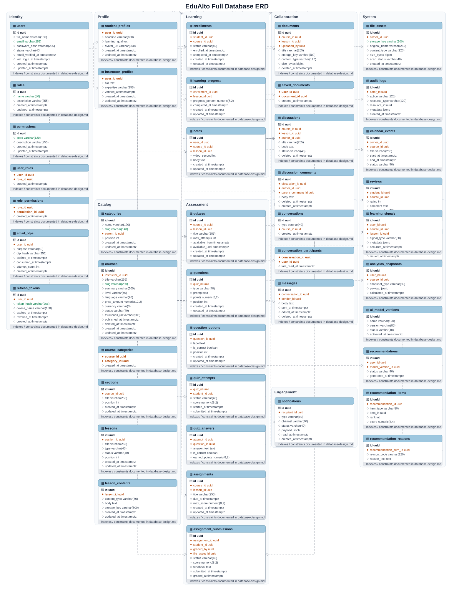

# Database Design

Database chính của EduAlto là PostgreSQL. Thiết kế này phục vụ modular monolith foundation, ưu tiên schema rõ ràng, constraint thật, dữ liệu tiếng Anh trong database và khả năng mở rộng AI sau này mà không làm nhiễu core LMS.

## Design principles

- Table và column dùng tiếng Anh, `snake_case`.
- Primary key mặc định dùng UUID.
- Entity quan trọng có `created_at`, `updated_at`.
- Enum lưu dạng string ổn định, không lưu ordinal.
- Dùng foreign key, unique constraint và index rõ ràng.
- Không lưu plaintext password, OTP hoặc refresh token.
- PostgreSQL là system of record; Redis không thay thế database.
- AI tables chỉ đọc signal từ LMS core, không đưa AI logic vào bảng course/learning cốt lõi.

## Diagram index

Nguồn ERD Mermaid nằm trong `docs/database/diagrams/` và được render sang SVG để nhúng tài liệu:

- `00-database-overview.mmd`: tổng quan data domains.
- `01-core-identity-erd.mmd`: identity, role, permission, token, OTP.
- `02-course-learning-erd.mmd`: catalog, lesson, enrollment, progress.
- `03-assessment-erd.mmd`: quiz, assignment, submission, grading.
- `04-social-document-erd.mmd`: document, discussion, messaging, notification.
- `05-system-erd.mmd`: audit, file asset, calendar, review, certificate.
- `06-ai-extension-erd.mmd`: learning signal, recommendation, model version.
- `99-full-erd.mmd`: ERD hợp nhất ở mức foundation.
- `99-full-standard-erd.svg`: ERD tổng hợp dạng database table box, dùng khi cần hình chuẩn để đưa vào báo cáo.

## ERD

Full database ERD:

Full standard database ERD:

Core identity ERD:

## Data domains

| Domain | Main tables | Owner module | Notes |
| --- | --- | --- | --- |
| Identity | `users`, `roles`, `user_roles`, `email_otps`, `refresh_tokens` | `auth`, `user` | RUN #3 triển khai phân quyền theo role. `permissions` và `role_permissions` là extension quyền chi tiết cho giai đoạn sau. |
| Profile | `student_profiles`, `instructor_profiles` | `profile`, `instructor` | Profile mở rộng user, không thay thế `users`. |
| Course catalog | `categories`, `courses`, `course_categories`, `sections`, `lessons`, `lesson_contents` | `course`, `lesson` | Public listing chỉ trả course `PUBLISHED`. |
| Participation | `enrollments`, `learning_progress`, `notes` | `enrollment`, `learning` | Unique enrollment theo student/course. |
| Assessment | `quizzes`, `questions`, `question_options`, `quiz_attempts`, `quiz_answers`, `assignments`, `assignment_submissions` | `quiz`, `assignment` | Policy chấm điểm và deadline nằm ở service. |
| Content and collaboration | `documents`, `saved_documents`, `discussions`, `discussion_comments`, `conversations`, `conversation_participants`, `messages` | `document`, `discussion`, `messaging` | WebSocket chỉ broadcast sau khi persist message. |
| Engagement | `notifications`, `calendar_events`, `reviews`, `certificates` | `notification`, `schedule`, `review`, `certificate` | Notification có REST sync và realtime delivery. |
| Insight and AI | `learning_signals`, `analytics_snapshots`, `ai_model_versions`, `recommendations`, `recommendation_items`, `recommendation_reasons` | `analytics`, `ai` | AI có thể tắt mà core LMS vẫn chạy. |

## Core schema

### Identity

`users`

- `id uuid primary key`
- `full_name varchar(160) not null`
- `email varchar(255) not null`
- `password_hash varchar(255) not null`
- `status varchar(40) not null`
- `email_verified_at timestamptz null`
- `last_login_at timestamptz null`
- `created_at timestamptz not null`
- `updated_at timestamptz not null`

Constraints and indexes:

- unique `uk_users_email(email)`
- index `idx_users_status(status)`
- check `status in ('PENDING_VERIFICATION','ACTIVE','LOCKED','DISABLED')`

`roles`, `user_roles`

- Role names: `STUDENT`, `INSTRUCTOR`, `ADMIN`.
- `user_roles` has unique `(user_id, role_id)`.
- `permissions` và `role_permissions` có thể được thêm sau với code ổn định như `course:write` hoặc `admin:user:manage`.

`email_otps`

- Lưu OTP hash, purpose, expiry, verification timestamp, consumed timestamp và attempt counters.
- Unique active OTP is enforced in service because partial uniqueness depends on expiry/consumed state.
- Index `(user_id, purpose, expires_at)`.

`refresh_tokens`

- Stores token hash, device metadata, expiry and revoked timestamp.
- Index `(user_id, expires_at)`.
- Unique `token_hash`.

### Profile

`student_profiles`

- `user_id uuid primary key references users(id)`
- `headline varchar(180) null`
- `learning_goal text null`
- `avatar_url varchar(500) null`
- `created_at`, `updated_at`

`instructor_profiles`

- `user_id uuid primary key references users(id)`
- `bio text null`
- `expertise varchar(255) null`
- `verified_at timestamptz null`
- `created_at`, `updated_at`

### Course catalog

`categories`

- `id uuid primary key`
- `name varchar(120) not null`
- `slug varchar(140) not null unique`
- `parent_id uuid null references categories(id)`
- `position integer not null default 0`
- `created_at`, `updated_at`

`courses`

- `id uuid primary key`
- `instructor_id uuid not null references instructor_profiles(user_id)`
- `title varchar(255) not null`
- `slug varchar(280) not null unique`
- `summary varchar(500) null`
- `description text null`
- `level varchar(40) not null`
- `language varchar(20) not null default 'vi'`
- `price_amount numeric(12,2) not null default 0`
- `currency varchar(3) not null default 'VND'`
- `status varchar(40) not null`
- `thumbnail_url varchar(500) null`
- `published_at timestamptz null`
- `deleted_at timestamptz null`
- `created_at`, `updated_at`

Indexes:

- `idx_courses_instructor_id(instructor_id)`
- `idx_courses_status_published_at(status, published_at desc)`
- `idx_courses_level(level)`
- `idx_courses_title_search` should use PostgreSQL full-text or trigram in a later implementation phase.

`course_categories`

- unique `(course_id, category_id)`

`sections`

- unique `(course_id, position)`
- index `idx_sections_course_id(course_id)`

`lessons`

- unique `(section_id, position)`
- index `idx_lessons_section_id(section_id)`
- Status values: `DRAFT`, `PUBLISHED`, `ARCHIVED`.

`lesson_contents`

- Stores content type and metadata for video/article/file.
- Large file binaries are not stored in PostgreSQL; only metadata and storage key are stored.

### Participation and progress

`enrollments`

- `id uuid primary key`
- `student_id uuid not null references users(id)`
- `course_id uuid not null references courses(id)`
- `status varchar(40) not null`
- `enrolled_at timestamptz not null`
- `completed_at timestamptz null`
- `created_at`, `updated_at`

Constraints:

- unique `uk_enrollments_student_course(student_id, course_id)`
- index `idx_enrollments_course_status(course_id, status)`

`learning_progress`

- unique `(enrollment_id, lesson_id)`
- `completed_at` marks completion.
- `progress_percent numeric(5,2)` remains bounded by service validation and optional check.

`notes`

- Optional `lesson_id`, optional `video_second`.
- Student can only access own notes.

### Assessment

`quizzes`, `questions`, `question_options`

- Question type values: `SINGLE_CHOICE`, `MULTIPLE_CHOICE`, `TRUE_FALSE`, `SHORT_TEXT`.
- `question_options.is_correct` is only returned by API when quiz policy allows it.
- Position uniqueness is enforced per quiz/question.

`quiz_attempts`, `quiz_answers`

- Attempt status values: `IN_PROGRESS`, `SUBMITTED`, `GRADED`.
- Unique attempt limit is enforced in service because policies differ by quiz.
- Index `(student_id, quiz_id, submitted_at)`.

`assignments`, `assignment_submissions`

- Submission status values: `DRAFT`, `SUBMITTED`, `GRADED`, `RETURNED`.
- File metadata includes `file_asset_id`, not raw file bytes.
- Grade changes should be auditable via application log or future grade history table.

### Collaboration and engagement

`documents`, `saved_documents`

- Documents belong to course and optionally lesson.
- Saved documents have unique `(user_id, document_id)`.

`discussions`, `discussion_comments`

- Discussions can be course-level or lesson-level.
- Comments support parent-child threading through `parent_comment_id`.
- Soft delete uses `deleted_at` to preserve thread context.

`conversations`, `conversation_participants`, `messages`

- Conversation type values: `DIRECT`, `GROUP`, `COURSE`.
- Unique direct conversation should be enforced at service level or with a normalized conversation key.
- Messages are persisted before WebSocket broadcast.

`notifications`

- Status values: `UNREAD`, `READ`, `ARCHIVED`.
- Channel values: `IN_APP`, `EMAIL`.
- Index `(recipient_id, status, created_at desc)`.

`calendar_events`, `reviews`, `certificates`

- Reviews have unique `(student_id, course_id)`.
- Certificates have unique `(student_id, course_id)`.
- Calendar events use `start_at`, `end_at` with timezone-aware timestamps.

### Insight and AI extension

`learning_signals`

- Append-only facts from core modules such as `COURSE_ENROLLED`, `LESSON_COMPLETED`, `QUIZ_SUBMITTED`.
- Contains actor, course/lesson/assessment context and JSONB metadata.

`analytics_snapshots`

- Aggregated metrics for student, instructor or admin dashboards.
- Snapshot type controls shape of JSONB payload.

`ai_model_versions`, `recommendations`, `recommendation_items`, `recommendation_reasons`

- Recommendations reference model version and are safe to delete/rebuild.
- The `ai` module reads `learning_signals` and `analytics_snapshots`; it does not own course/enrollment/progress tables.

## Normalization and denormalization

- Transactional tables stay normalized to avoid conflicting sources of truth.
- Denormalized counters such as course rating average or enrollment count may be introduced later, but must be derived and refreshable.
- JSONB is acceptable for metadata, analytics payloads and AI reasons, not for core relational fields that need FK/queries.

## Transaction boundaries

- Registration: create user, default role, OTP record in one transaction; email send happens after commit or through an outbox-style follow-up later.
- Enrollment: verify course and duplicate enrollment, create enrollment and initial progress in one transaction.
- Lesson completion: update progress and append learning signal in one transaction.
- Quiz submission: persist attempt/answers/score and append signal in one transaction.
- Messaging: persist message before realtime broadcast.

## Concurrency rules

- Use unique constraints as final protection for duplicate email, enrollment, saved document, review and certificate.
- Use optimistic locking on entities with collaborative edits when implementation needs it.
- Refresh token rotation must revoke the previous token atomically before issuing the next token.
- Quiz submission should reject duplicate final submission for the same attempt.

## Migration strategy

- Use Flyway or Liquibase before implementing persistence-heavy features.
- RUN #3 dùng Flyway với `backend/src/main/resources/db/migration/V1__auth_user_management.sql` cho vertical slice auth/user đầu tiên.
- Migration must include UUID extension strategy, FK constraints, unique constraints and key indexes.
- Test profile may use H2 only if PostgreSQL compatibility gaps are covered by integration tests or Testcontainers.

## Open questions for implementation

1. Use Flyway or Liquibase for migrations?
2. Use PostgreSQL `gen_random_uuid()` or application-generated UUID?
3. Should local dev require Docker PostgreSQL by default?
4. Which tables require soft delete in the first implementation phase?
5. Should course price be implemented now or deferred?
6. Does payment belong to foundation or a later phase?
7. Should category hierarchy be single-parent only?
8. How many roles are seeded initially?
9. Are permissions seeded as fixed data or code-derived data?
10. Should email OTP be tied to user or raw email before user creation?
11. What is OTP TTL and resend policy?
12. How long do refresh tokens live?
13. Do we need device/session management UI?
14. Which course fields are searchable in phase one?
15. Should full-text search use PostgreSQL text search or external search later?
16. Do lessons require mixed content blocks or one content type per lesson?
17. Are documents stored locally in development and object storage in production?
18. What file types are allowed for assignment submissions?
19. Are quizzes timed in phase one?
20. Do quiz attempts allow resume?
21. Should grades support rubric details?
22. Do discussions need moderation status before publish?
23. Do conversations support attachments in phase one?
24. Should notification email delivery be async only?
25. What analytics snapshots are required for the first dashboard?
26. Which learning signals are enough for the first AI recommendation experiment?
27. What retention policy applies to audit logs and AI signals?
