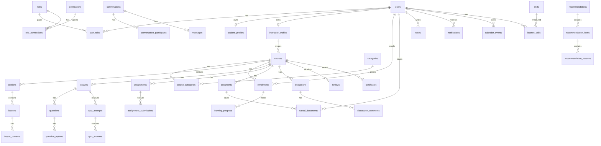

# Database Design

Database: PostgreSQL. Table and column names use English snake_case. Primary keys use UUID. Important tables include `created_at` and `updated_at`; content tables that need recovery/audit may include `deleted_at`.

## ERD

## Core tables

### users

- `id uuid pk`
- `full_name varchar(160) not null`
- `email varchar(255) not null unique`
- `password_hash varchar(255) not null`
- `status varchar(40) not null`
- `email_verified_at timestamptz null`
- `created_at timestamptz not null`
- `updated_at timestamptz not null`

Indexes:

- unique `users_email_key(email)`
- index `idx_users_status(status)`

### roles, permissions, user_roles, role_permissions

Use many-to-many mapping. Role names: `STUDENT`, `INSTRUCTOR`, `ADMIN`.

### courses

- `id uuid pk`
- `instructor_id uuid fk instructor_profiles(id)`
- `title varchar(255) not null`
- `slug varchar(280) not null unique`
- `description text`
- `level varchar(40)`
- `language varchar(20) default 'vi'`
- `price_amount numeric(12,2) not null default 0`
- `currency varchar(3) not null default 'VND'`
- `status varchar(40) not null`
- `published_at timestamptz null`
- `created_at timestamptz not null`
- `updated_at timestamptz not null`

Indexes:

- `idx_courses_instructor_id`
- `idx_courses_status`
- `idx_courses_slug`

### sections, lessons, lesson_contents

Sections belong to courses and lessons belong to sections. Use `position` for ordering, unique `(course_id, position)` for sections and `(section_id, position)` for lessons.

### enrollments

- `id uuid pk`
- `student_id uuid fk users(id)`
- `course_id uuid fk courses(id)`
- `status varchar(40) not null`
- `enrolled_at timestamptz not null`
- `completed_at timestamptz null`

Constraints:

- unique `(student_id, course_id)`
- index `(course_id, status)`

### learning_progress

Tracks lesson-level completion and progress percentage.

- unique `(enrollment_id, lesson_id)`
- index `idx_learning_progress_enrollment`

### quizzes, questions, question_options, quiz_attempts, quiz_answers

Question type is string enum: `SINGLE_CHOICE`, `MULTIPLE_CHOICE`, `TRUE_FALSE`, `SHORT_TEXT`. Store points per question and score per attempt.

### assignments, assignment_submissions

Submission status: `DRAFT`, `SUBMITTED`, `GRADED`, `RETURNED`. Store file metadata, grade and instructor feedback.

### documents, saved_documents, notes

Documents attach to course/lesson. Saved documents are user bookmarks. Notes can attach to course/lesson and optional timestamp for video notes.

### discussions, discussion_comments

Support course/lesson-level discussion. Comments support parent-child threading with `parent_comment_id`.

### conversations, conversation_participants, messages

Conversation type: `DIRECT`, `GROUP`, `COURSE`. Messages store `sender_id`, `body`, `sent_at`, `edited_at`, `deleted_at`.

### notifications

Notification channel: `IN_APP`, `EMAIL`. Status: `UNREAD`, `READ`, `ARCHIVED`.

### AI tables

`learning_signals` is the bridge from LMS core to AI. It stores signal type, actor, course/lesson context and JSONB metadata. Recommendations store model version, target user, item type, item id, rank and reasons.

## Migration strategy

Use Flyway or Liquibase in a later phase. Foundation keeps schema documented; first implementation phase should add `V1__initial_schema.sql`.

## Enum strategy

Store enum values as uppercase strings. Never store Java enum ordinals.

## Soft delete

Use `deleted_at` for courses, lessons, documents, discussions and messages where recovery/audit matters. Do not soft delete join tables unless required.
